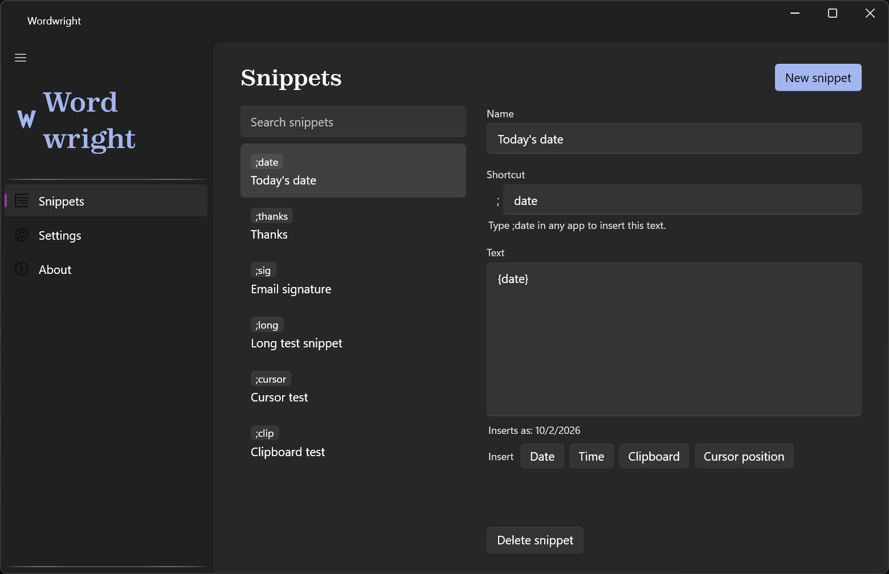

# Wordwright


A free, open-source text expander for Windows: type a shortcut like `;sig` and your saved text appears, in any app. No account, no sign-in, no network access.

[](https://github.com/Jsingh-26/Wordwright/actions/workflows/ci.yml)

**Current release: [v0.2.0](https://github.com/Jsingh-26/Wordwright/releases/tag/v0.2.0)** (installer and portable zip).



- **Snippets.** No limit on how many you keep or how long they are.
- **Variables.** `{date}`, `{time}`, `{clipboard}` and `{cursor}` fill themselves in as the snippet expands.
- **Private by design.** Nothing you type is written to disk or to a log, and the app makes no network connections of its own.
- **Your data, in one place.** Everything lives in `%AppData%\Wordwright`, and snippets export and import as JSON.

> A *wright* is a maker: a shipwright builds ships, a wheelwright builds wheels. Wordwright builds your words.

## Install

1. Download **`Wordwright-win-Setup.exe`** from the [latest release](https://github.com/Jsingh-26/Wordwright/releases/latest) and run it. It installs for your user account only, so no administrator rights are needed.
2. Wordwright starts in the tray (the "W" by the clock; on Windows 11 it may sit in the overflow, behind the ^). A short welcome lets you try it: type `;date` and today's date appears.
3. Open the tray icon to add your own snippets.

Prefer not to install? **`Wordwright-win-Portable.zip`** from the same release runs from any folder. A Microsoft Store version is on the way.

To uninstall, use **Settings → Apps → Installed apps → Wordwright**. Your snippets stay in `%AppData%\Wordwright` until you delete that folder.

### "Windows protected your PC"

The first time you run the installer, Microsoft Defender SmartScreen may say *"Windows protected your PC"* and name an **unknown publisher**. That is because the installer is not signed with a paid code-signing certificate, which a free, one-person project does not have. It does not mean anything was found in the file.

To continue, click **More info**, then **Run anyway**. If you would rather check first, the source for every release is in this repository, and you can build it yourself with `dotnet build`. The Microsoft Store version, once published, is signed by the Store and shows no warning.

## Privacy

- **No network access.** Wordwright opens no connections at all: no telemetry, no analytics, no crash reports, no update check. You can confirm it in Resource Monitor's Network tab.
- **Nothing you type is stored.** To spot a shortcut, Wordwright keeps the last 64 characters you typed in memory only, and clears them whenever you click, switch windows or press Enter, Escape or an arrow key. Typed text, your clipboard and your snippet text are never written to a log.
- **Your clipboard comes back.** A snippet is pasted through the clipboard, and whatever you had copied is put back straight afterwards. Wordwright asks Windows to keep its paste out of clipboard history (Win+V).
- **Your data, in one place.** Snippets and settings are plain JSON in `%AppData%\Wordwright`. Nothing is kept anywhere else.
- **Quiet where it matters.** Wordwright cannot always tell when you are typing a password, so Settings lets you turn it off in chosen apps, such as your password manager.

## How it works

- A low-level keyboard hook runs on its own thread and only queues each key, so typing is never slowed down.
- Typed characters go into an in-memory buffer of at most 64 characters. Enter, Esc, arrows, mouse clicks, switching windows or a 5-second pause clear it. It is never saved.
- After each character, a matcher checks whether the buffer ends with a shortcut on a word boundary. If `;s` and `;sig` both exist, it waits for the next space or punctuation before choosing.
- On a match it deletes the typed shortcut, fills in the variables, and pastes the text through the clipboard, then puts your clipboard back. The pasted text is marked so it stays out of Windows clipboard history (Win+V).
- The code is split into `Wordwright.Core` (pure .NET, no UI, unit-tested), `Wordwright.Platform` (Windows hook, clipboard, input) and `Wordwright.App` (WPF tray app). Details: [`docs/ARCHITECTURE.md`](docs/ARCHITECTURE.md).

## Decisions

- **The AI rewriter was parked, not shipped untested.** See the next section.
- **A 5-second typing gap resets the shortcut.** A shortcut typed with a long pause in the middle of it never expands (decision D3 in [`docs/PLAN.md`](docs/PLAN.md)).
- **Users choose apps to switch it off in.** Windows does not reliably tell other apps when a password field has focus, so instead of guessing, an excluded-apps list turns Wordwright off in the programs you pick.

## What is not here, and why

An earlier Wordwright also had an **on-device AI writing assistant**: select text, press a hotkey, and a model running entirely on your PC rewrote it in place. It was built, it worked, and three releases contained it.

It is not part of this application. It needs a machine with enough free memory to load a model, and a range of devices to judge speed and quality on — neither of which was available to test it properly. Rather than ship an untested feature that downloads a multi-gigabyte model, it was parked.

**All of it is preserved**, and the whole story — what was planned, how it was built, what was proven and what never was, and how to pick it up again — is in [`docs/AI_REWRITING.md`](docs/AI_REWRITING.md). The code is on the [`ai-rewriting`](https://github.com/Jsingh-26/Wordwright/tree/ai-rewriting) tag, and releases **v0.1.3–v0.1.5** contain it.

## Tests and running locally

Needs Windows and the .NET 10 SDK.

```bash
dotnet build -c Release
dotnet test -c Release                      # 140 xUnit tests for Wordwright.Core
dotnet run --project src/Wordwright.App     # starts the tray app
```

CI runs the build and the tests on Windows for every push to `main` and every pull request.

## Status

Snippets only, and heading for the Microsoft Store. The plan and what is left are in [`docs/PLAN.md`](docs/PLAN.md).

## Documentation

| File | What it covers |
|---|---|
| [`docs/AI_REWRITING.md`](docs/AI_REWRITING.md) | The parked AI writing assistant: what it was, how it was built, why it stopped, how to resume |
| [`AGENTS.md`](AGENTS.md) | Rules for AI coding agents working in this repo |
| [`docs/PLAN.md`](docs/PLAN.md) | Build plan, current handoff and acceptance criteria |
| [`docs/ARCHITECTURE.md`](docs/ARCHITECTURE.md) | Projects, components, data files, key technical decisions |
| [`docs/DESIGN.md`](docs/DESIGN.md) | Visual design system, logo system and screen layouts |
| [`docs/UX_COPY.md`](docs/UX_COPY.md) | Every piece of user-facing text |
| [`brand/`](brand/) | Logo and icon files |

## License

MIT.
